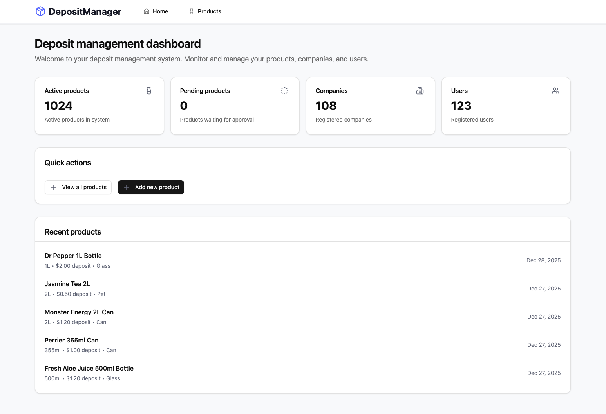

# Sensoneo React Senior Developer Interview Task

Welcome to the Sensoneo React Senior Developer interview task! This project is designed to assess your React, TypeScript, and frontend development skills.

## Project Overview

This is a **Deposit Management System** built with React and TypeScript. The application helps manage products, companies, and users in a deposit return system context.

## Project Structure

### 🖥️ **Server** (`/server` folder)

- **Express.js API server** with mock data
- Provides REST endpoints for products, companies, and users
- Includes comprehensive API documentation (Swagger)
- **⚠️ IMPORTANT: You cannot modify anything in the `/server` folder**
- Start the server with: `cd server && npm install && npm run dev`
- Server runs on `http://localhost:3001`
- Swagger API docs are available on `http://localhost:3001/api-docs`

### 💻 **Client** (`/src` folder)

- **React 19 + TypeScript** frontend application
- Your main working area - modify anything you need here
- Client runs on `http://localhost:5173`

## What's Already Set Up For You

We've prepared a solid foundation to help you focus on the core tasks:

### 🏗️ **Architecture & Routing**

- **React Router v7** with layout structure
- **TanStack Query** for API state management (configured with sensible defaults)
- Clean modular project structure with separate folders for components and features

### 🎨 **UI & Styling**

- **Tailwind CSS** for styling
- **shadcn/ui** component library with pre-built components:
  - `Table`, `Card`, `Button`, `Input`, `Select`, `Checkbox`
  - `Badge`, `Skeleton`, `Pagination`, and more
- **Lucide React** icons

### 🔧 **Development Tools**

- **Vite** for fast development and building
- **ESLint** and **Prettier** for code quality
- **TypeScript** configuration ready to use

## Your Freedom

While we've provided a solid foundation, **you're free to:**

- Install and use any additional libraries you prefer
- Modify the existing code structure if needed
- Add your own components, utilities, or helpers
- Choose your preferred patterns and approaches

## 🎯 **Your Tasks**

### Task 1: Create a Dashboard (Homepage)

**Objective**: Implement a dashboard based on the provided design mockup (`docs/dashboard.png`).



**Requirements**:

- Display key metrics (active products, pending products, companies, users)
- Show a "Recent products" section with 5 latest registered **active** products
- Include quick action buttons
- Match the design and layout shown in the mockup
- Fetch real data from the API endpoints (real data might differ from values in design mockup)

### Task 2: Products Table with Filtering

**Objective**: Create a products page with a table that allows filtering by active state. Design is up to you.

**Requirements**:

- Display all products in a table format
- Include relevant product information (name, packaging, deposit, volume, etc.)
- Implement filtering by product active/inactive status
- Make sure the table can handle large data sets

## 🚀 **Getting Started**

### **Step 1: Clone the Repository**

```bash
git clone https://sensoneo@dev.azure.com/sensoneo/react-interview-tasks/_git/senior-react-interview-task
cd senior-react-interview-task
```

### **Step 2: Start the API Server**

```bash
# In the root directory
cd server
npm install
npm run dev
```

### **Step 3: Start the Client Application**

```bash
# In the root directory (not in server folder)
npm install
npm run dev
```

### **Step 4: Open Your Browser**

- Client: `http://localhost:5173`
- API Documentation: `http://localhost:3001/api-docs`

## 📝 **Notes**

- **TypeScript**: You'll need to create your own type definitions by examining the API responses
- **API Structure**: All API responses follow a consistent format with `success`, `data`, and `total` fields
- **Data**: The server contains realistic mock data with both active and inactive products
- **Time**: Focus on code quality, proper TypeScript usage, and clean component architecture
- **Questions**: Feel free to ask questions about requirements or clarifications

## 🔍 **What We're Looking For**

- Correctness of your solution
- Performance
- Clean, readable, and maintainable code
- Proper TypeScript usage
- Effective use of React patterns
- Good component structure and separation of concerns
- Error handling and loading states
- Attention to detail in matching the design

You're not expected to finish everything, but it's better to do less and properly than to do more and poorly.

## 📤 **How to Submit Your Solution**

⚠️ **Important**: Do NOT push your changes to our original repository. You must create your own repository for your solution.

1. **Create your own repository**:
   - Create a **public repository** on either:
     - **GitHub** (github.com)
     - **Microsoft Azure DevOps** (dev.azure.com)

2. **Set up your working repository**:

   ```bash
   # After cloning our repository and making your changes
   git remote remove origin
   git remote add origin https://github.com/your-username/your-repo-name.git
   # (or your Azure DevOps URL)

   # Squash all your work into a single commit
   git add .
   git commit -m "Complete interview tasks: Dashboard and Products table with filtering"
   git push -u origin main
   ```

   Please **squash all your commits** into a single commit before submission. This makes the code review process cleaner and more focused.

3. **Submit the link**:
   - Send us the public repository URL
   - Make sure the repository is accessible without authentication

**Example submissions**:

```
GitHub: https://github.com/your-username/sensoneo-interview-task
Azure: https://dev.azure.com/your-org/your-project/_git/repo-name
```

Good luck! 🚀
